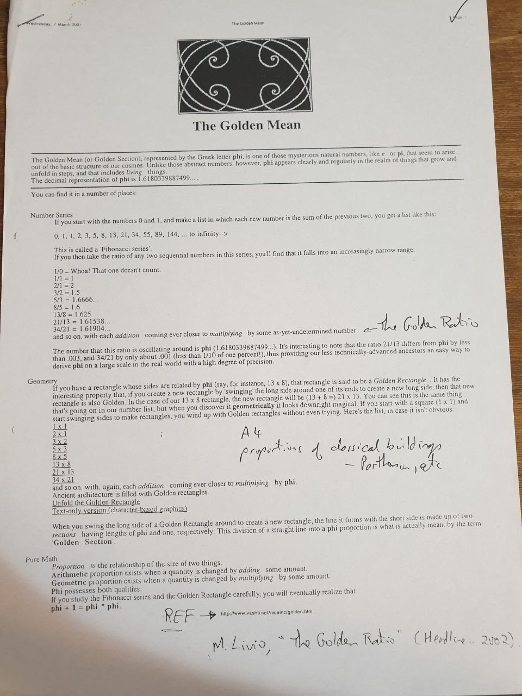

# Salam, Konnichiwa, Hallo, Ciao, Hola, Namaste !! 🐉 🦘 🖥️ 👨‍🎨

## Random Maths

### Exponents

- two examples of expanding the exponent are: $3^4 = 3 \cdot 3 \cdot 3 \cdot 3 = 81$ and $2^{-3} = (\frac{1}{2})^3 = \frac{1}{2^3} = \frac{1}{2 \cdot 2 \cdot 2} = \frac{1}{8}$
- when multiplying powers of the same base add exponents togethor: $x^a \cdot x^b = x^{a+b}$
- when dividing powers of the same base you subtract the exponents: $\frac{x^a}{x^b} = x^a \div x^b = x^{a-b}$
- any number except zero when raised to the power of zero equals one: $n^3 \div n^3 = n^{3-3} = n^0 = 1$ as long as $n \neq 0$
- the power of power is: $(a^m)^p = a^{m \cdot p}$

### Misc

- the equation of a unit circle is: $x^2 + y^2 = 1$
- the relationship between sine and cosine is famously shown with the Pythagorean identity: $\sin^2\theta + \cos^2\theta = 1$
- absolute value or modulus of a complex number $a + bi$ is $$|a + bi| = \sqrt{a^2 + b^2}$$ 

