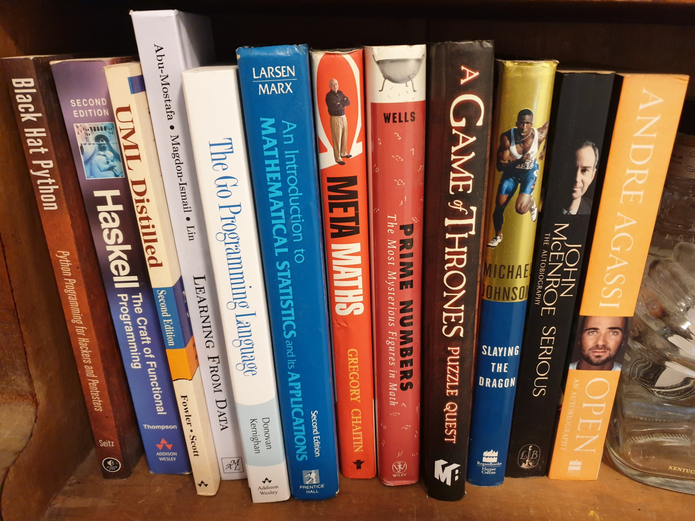
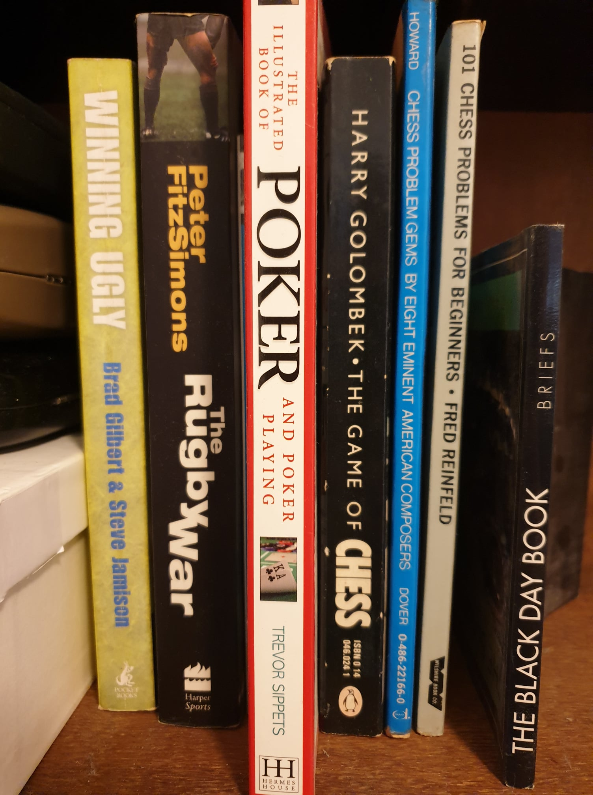
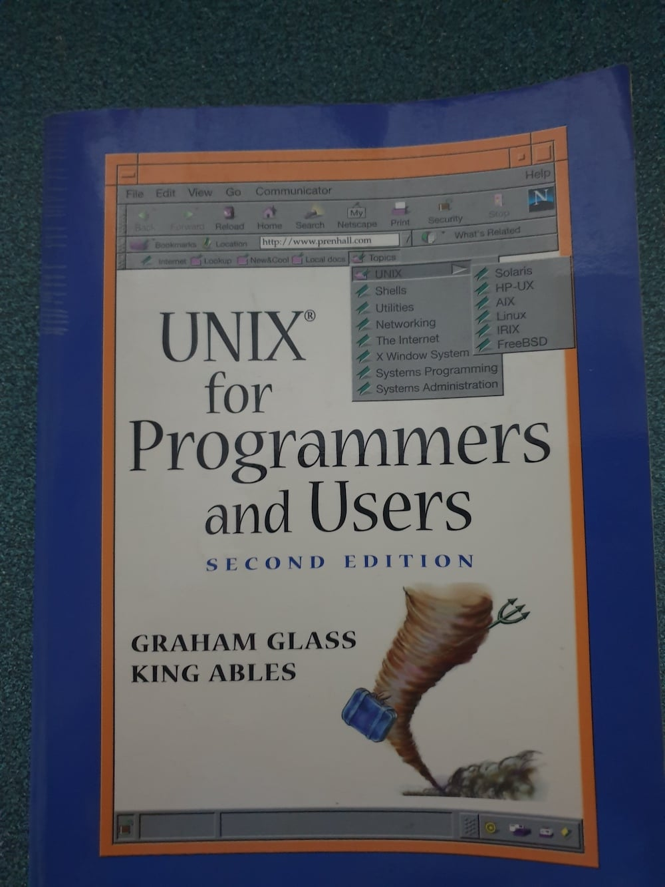
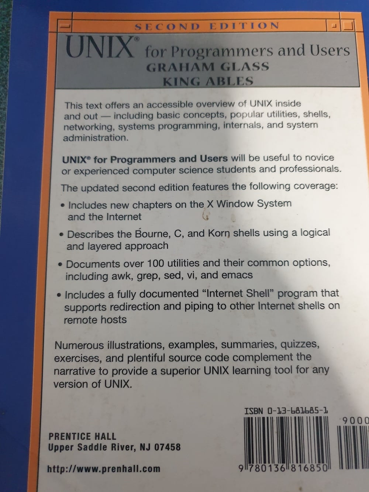
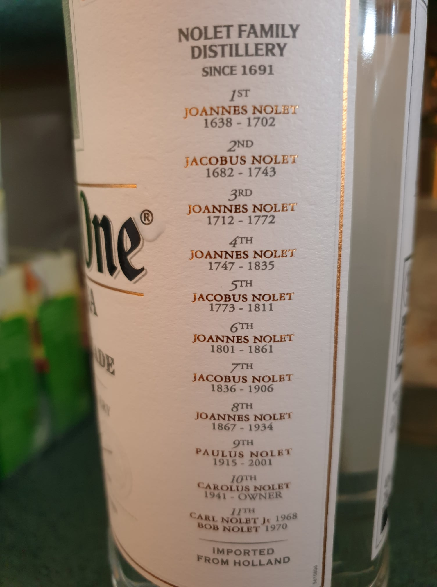
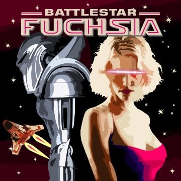
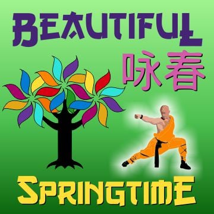

# Ruby is...

## A dynamic, open source programming language with a focus on simplicity and productivity. It has an elegant syntax that is natural to read and easy to write.

### LinkedIn has been out of date from February 8, 2008; 12 years ago when GitHub first appeared.  GitHub is the real business social network and all the very smartest people and most successful companies are now on GitHub with their team. GitHub is about what you do and how much you contribute and how helpful you are.  Not like LinkedIn and Facebook where all your friends just click like. 

### These days the majority of society is brainwashed into going to University where they give you a degree if you have money. $30,000 and more just for a bit of paper that doesn't mean anything that they now give out to everyone. Strangely enough an easy introductory 7 kyu white belt kata on Codewars is a lot of time only solved by about 50% of people.

### Of course don't be fooled by those people that have industry based certificates. Based on Exam Labs stats they are now giving the certs out to 98.4% of people or basically just giving these qualifications out to everyone.  There is no point in having a test if everyone passes.

### Everyone is going to University and doing certs, but I learned in my life that you should take the path least travelled. Sign up to GitHub and [Codewars](https://www.codewars.com) and change your life !!!! 

#### [Kimbo Slice](https://en.wikipedia.org/wiki/Kimbo_Slice) is best known for mutual combat street fights which were spread across the Internet, leading Rolling Stone to call him "The King of the Web Brawlers". Kimbo Slice likes to fight anyone in the backyard !!!

#### [Yukihiro Matsumoto](https://en.wikipedia.org/wiki/Yukihiro_Matsumoto), also known as [Matz](https://github.com/matz), is a Japanese computer scientist and software programmer best known as the chief designer of the Ruby programming language and its reference implementation, Matz's Ruby Interpreter. Matz is the Super Grandmaster and he codes much faster !!!

#### The side of my dusty old bookshelf showing swag

