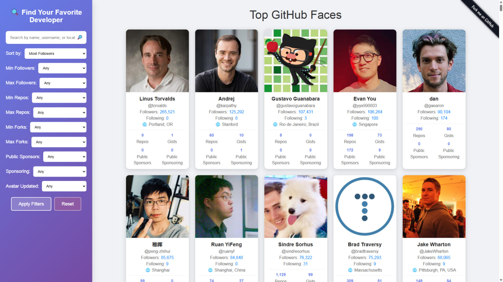

<!-- start-data -->

<h1>✨ How's tricks? 👋</h1>

  <table>
    <tr>
      <td align="center">
        
      </td>
  </table>

  <h2>👨‍🔬 🏩 💾 🇦🇺</h2>
  <h2><a href="https://github.com/john-bampton">John Bampton</a> is a dedicated, skilled, and community-oriented individual within the technology and local Brisbane communities</h2>

  <h2>Career Achievements ✅</h2>
  
  
  
  
  

---

## Explore the top GitHub users and their avatars. See the [400 most popular](https://github.com/john-bampton/john-bampton.github.io) GitHub faces in one place.

### We welcome contributions! Feel free to:

- Submit issues for bugs or feature requests.
- Fork the repository and open pull requests.
- Suggest new ways to improve the avatar grid or functionality.
- Spread the word by adding a ⭐ to this repository.

---

## Open Your Mind

- Fuel exploded in tube. (4). Flue
- Loves cracking answer. (5). Solve
- Pay no attention to damaged region. (6). Ignore

### Level Up

- Opening book beside Central Park tavern. (3). Bar
- Leaves note with answer. (3). Tea
- Vegetable found in vehicle along with rubbish. (6). Carrot
- PC's speed makes music session a failure. (8). Gigaflop
- Everything's ready: eg lass mostly prepared. (3,7,2). All systems go

### Mind Blown

- Sound asleep but not in when Dracula arrives? (3,3,3,5). Out for the count

---
