<!-- start-data -->

  <h1>✨ How's tricks? 🪄 🔮 🧝‍♂️ </h1>
  <a href="#">
    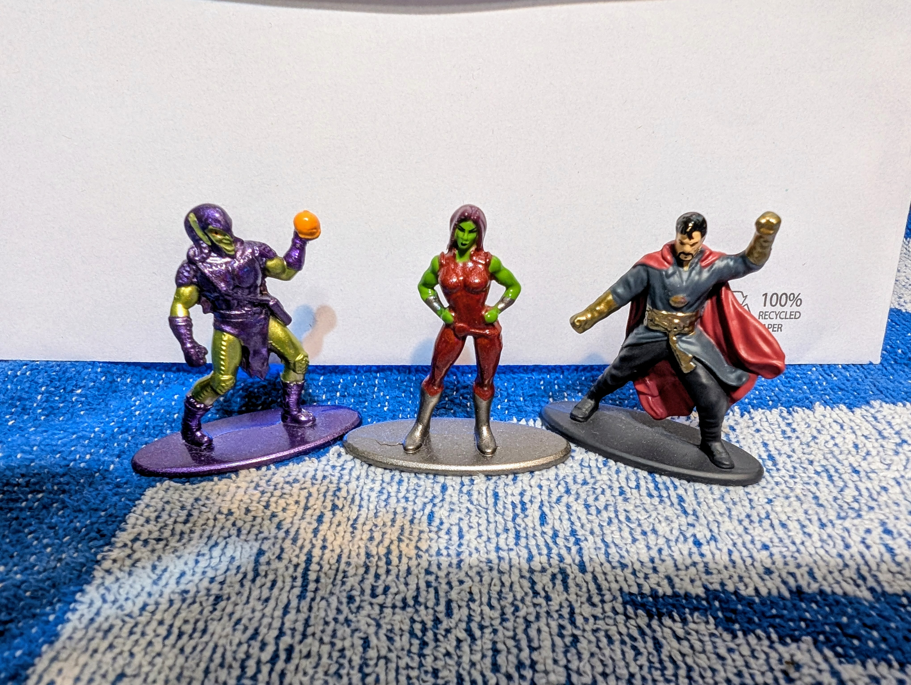
  </a>

  <h2>Random 2025 Shots 👨‍🎤 Getting Better With Age 👨‍🎨 Winter Is Coming 🥶</h2>
  <table>
    <tr>
      <td align="center">
        
      </td>
      <td align="center">
        
      </td>
      <td align="center">
        
      </td>
      <td align="center">
        
      </td>
    </tr>
    <tr>
      <td align="center">
        
      </td>
      <td align="center">
        
      </td>
      <td align="center">
        
      </td>
      <td align="center">
        
      </td>
    </tr>
    <tr>
      <td align="center">
        
      </td>
      <td align="center">
        <a href="#">
          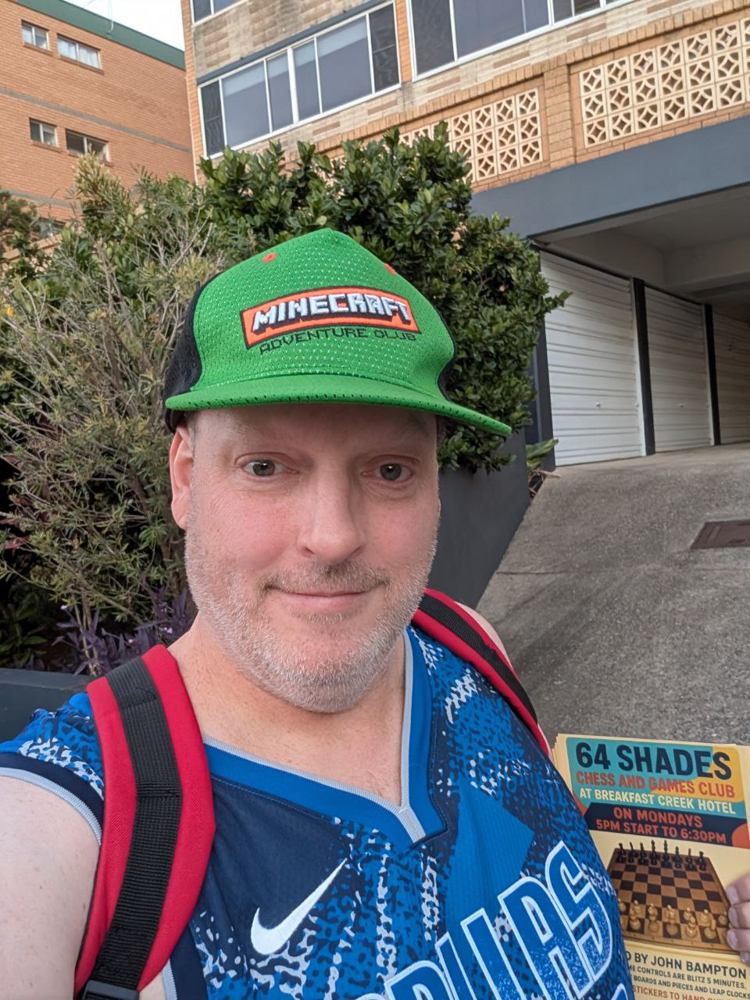
        </a>
      </td>
      <td align="center">
        
      </td>
      <td align="center">
        
      </td>
    </tr>
    <tr>
      <td align="center">
        
      </td>
      <td align="center">
        
      </td>
      <td align="center">
        
      </td>
      <td align="center">
        
      </td>
    </tr>
    <tr>
      <td align="center">
        
      </td>
      <td align="center">
        
      </td>
      <td align="center">
        
      </td>
      <td align="center">
        
      </td>
    </tr>
    <tr>
      <td align="center">
        
      </td>
      <td align="center">
        
      </td>
      <td align="center">
        
      </td>
      <td align="center">
        
      </td>
    </tr>
    <tr>
      <td align="center">
        
      </td>
      <td align="center">
        
      </td>
      <td align="center">
        
      </td>
      <td align="center">
        
      </td>
    </tr>
  </table>

  <h2>👨‍🔬 🏩 💾 🇦🇺</h2>
  <h2>John Bampton is a dedicated, skilled, and community-oriented individual within the technology and local Brisbane communities</h2>

  <h2>Career Achievements ✅</h2>
  
  
  
  
  
  

---

  <table>
    <tr>
      <td>
        <a href="#">
          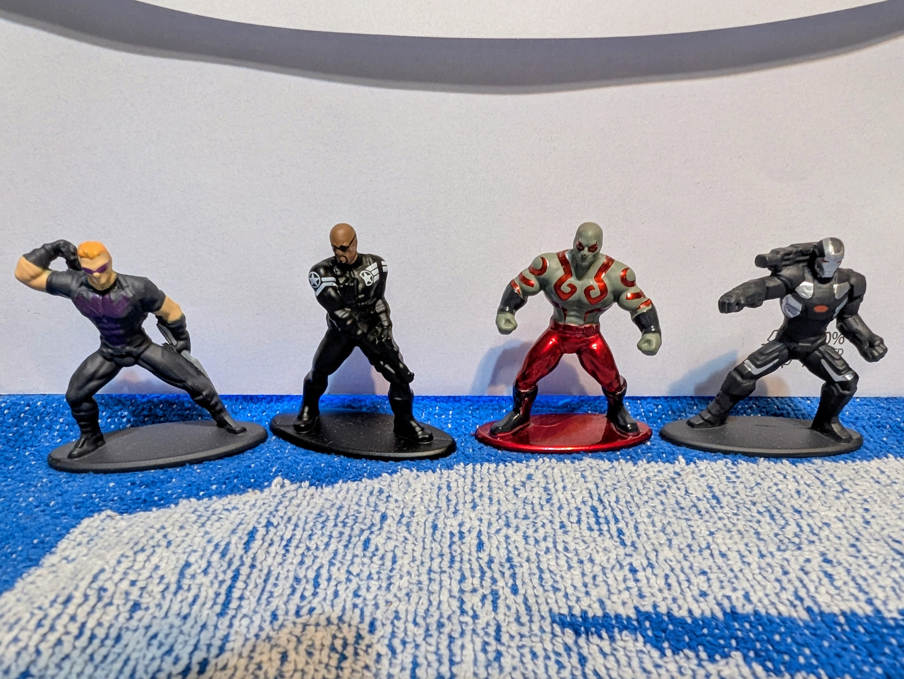
        </a>
      </td>
      <td>
        <a href="#">
          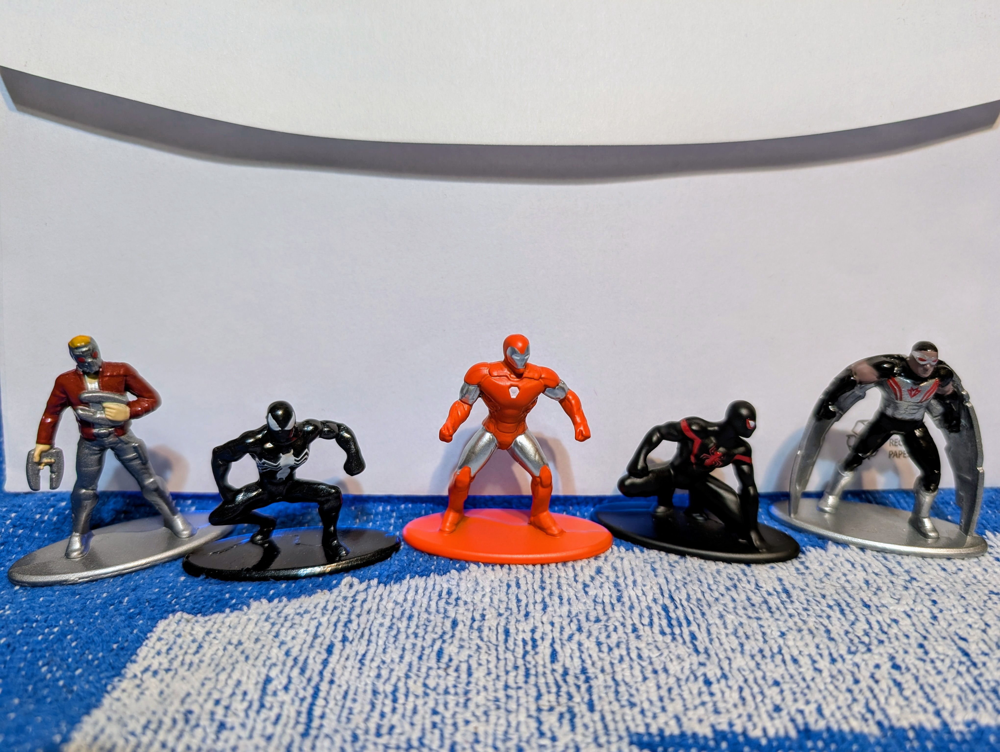
        </a>
      </td>
      <td>
        <a href="#">
        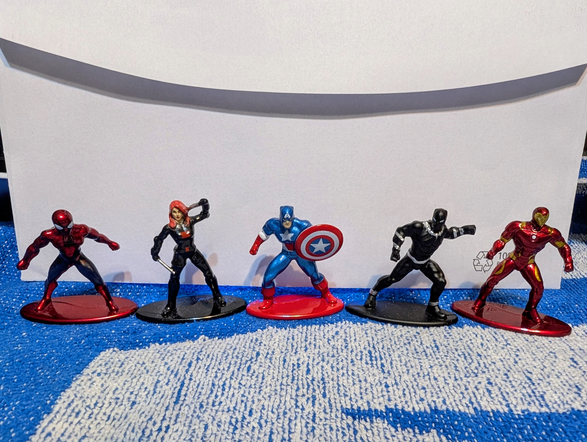
      </a>
      </td>
    </tr>
  </table>

---

## Explore the top GitHub users and their avatars. See the [400 most popular](https://github.com/john-bampton/john-bampton.github.io) GitHub faces in one place.

### We welcome contributions! Feel free to:

- Submit issues for bugs or feature requests.
- Fork the repository and open pull requests.
- Suggest new ways to improve the avatar grid or functionality.
- Spread the word by adding a ⭐ to the repository.

---

  

---

## Open Your Mind

- Fuel exploded in tube. (4). Flue
- Loves cracking answer. (5). Solve
- Pay no attention to damaged region. (6). Ignore

### Level One

- Opening book beside Central Park tavern. (3). Bar
- Leaves note with answer. (3). Tea
- Vegetable found in vehicle along with rubbish. (6). Carrot
- PC's speed makes music session a failure. (8). Gigaflop

### Level Two

- Everything's ready: eg lass mostly prepared. (3,7,2). All systems go
- Modern, before sixty seconds have passed. (2,2,3,6). Up to the minute

### Mind Blown

- Sound asleep but not in when Dracula arrives? (3,3,3,5). Out for the count

---

  <h2>Basketball Inventory</h2>
  <table>
    <tr>
      <td align="center">
        <h3>Reliance Basketball</h3>
        <a href="https://www.bigw.com.au/product/reliance-basketball-size-7-assorted-/p/7389641">
          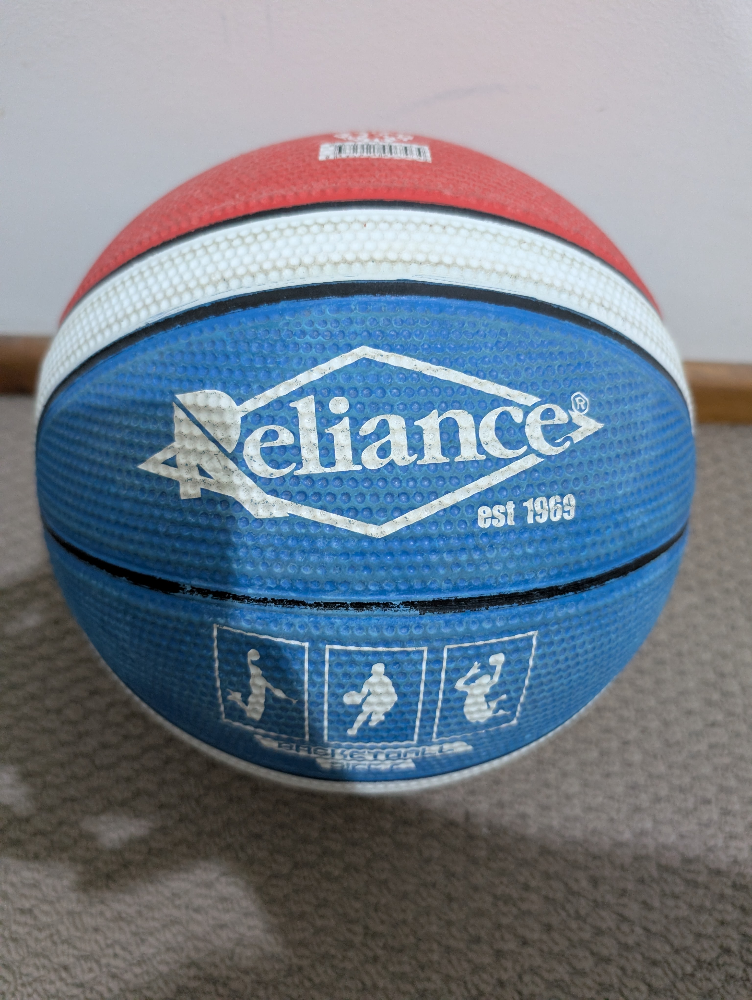
        </a>
      </td>
      <td align="center">
        <h3>Wilson 2024-2025 NBA Team City Icon Basketball</h3>
        <a href="https://www.wilson.com/en-us/product/2024-nba-team-city-edition-bskt-wz40339">
          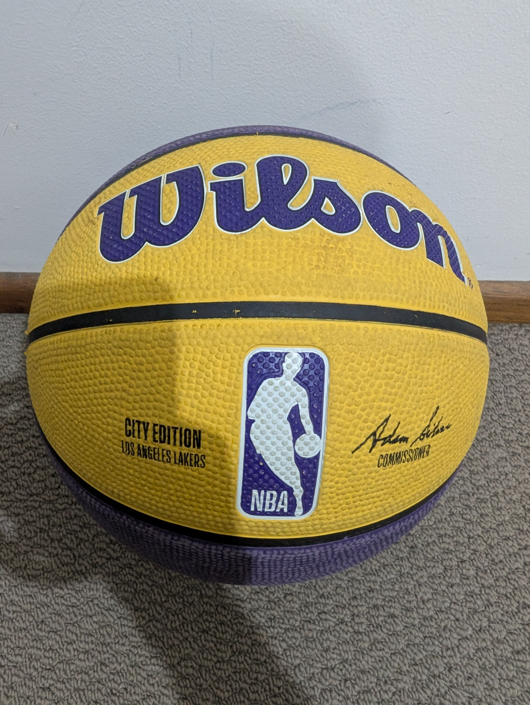 
        </a>
      </td>
    </tr>
    <tr>
      <td align="center">
        <h3>Wilson NBA All Team Retro Basketball</h3>
        <a href="https://www.wilson.com/en-us/product/nba-all-team-retro-bskt-wz40285">
          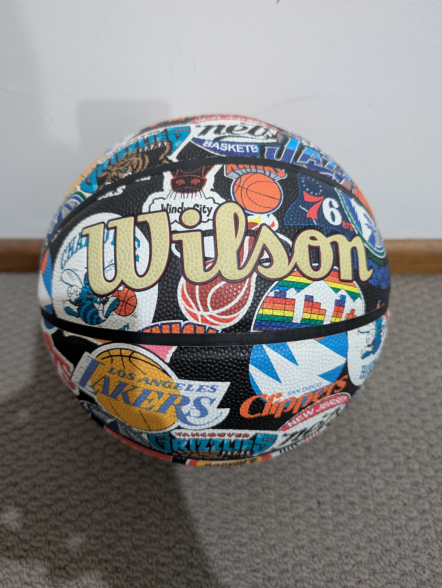
        </a>
      </td>
      <td align="center">
        <h3>Spalding React TF-250 All-Surface Basketball</h3>
        <a href="https://www.spalding.com.au/react-tf-250-all-surface-basketball.html">
          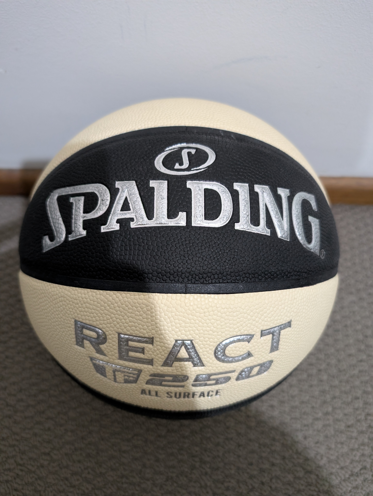 
        </a>
      </td>
    </tr>
    <tr>
      <td align="center" colspan="2">
        <h3>Molten BG3200 Series Indoor / Outdoor Basketball</h3>
        <a href="https://molten.com.au/products/bg3200-series-basketball">
          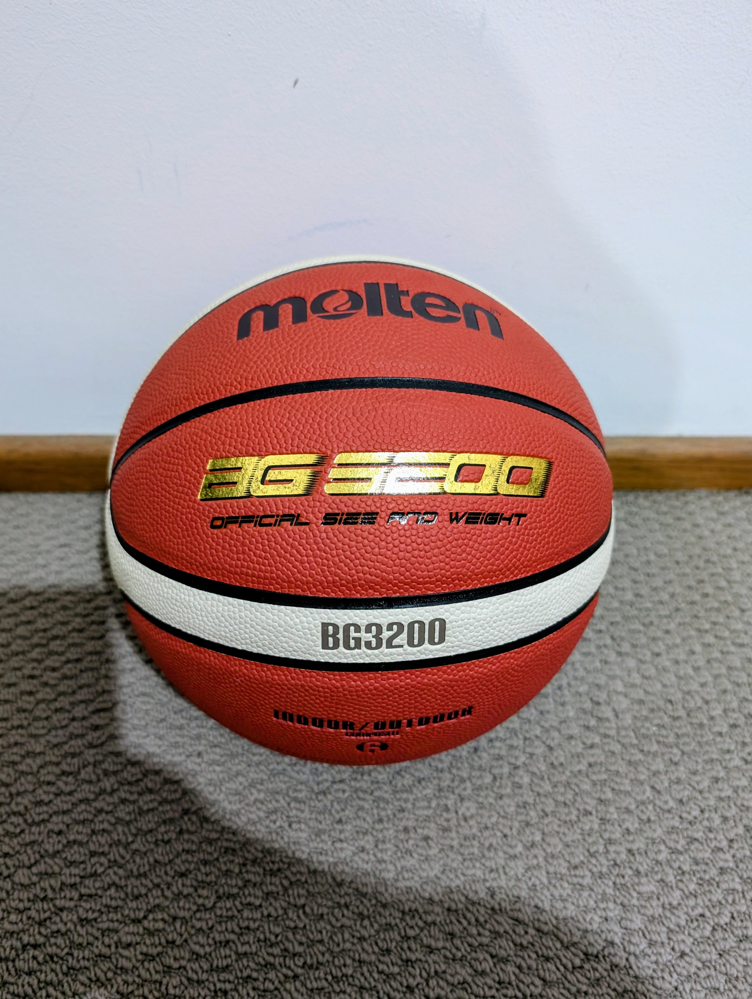
        </a>
      </td>
    </tr>
  </table>

  <a href="#">
    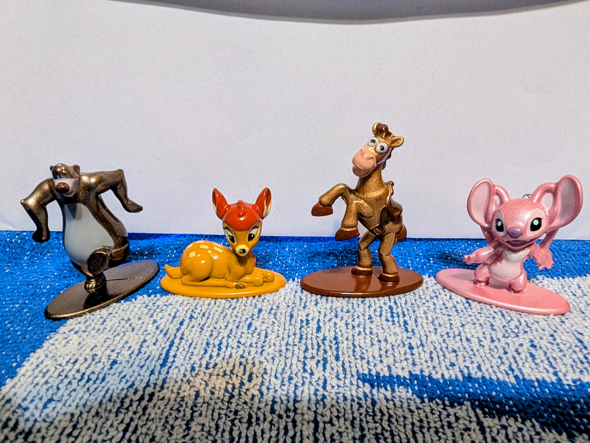
  </a>

---
