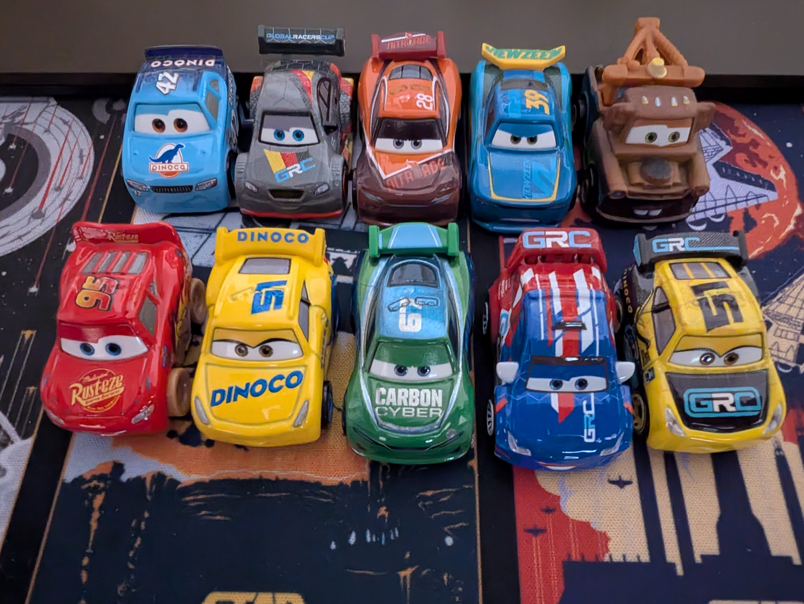
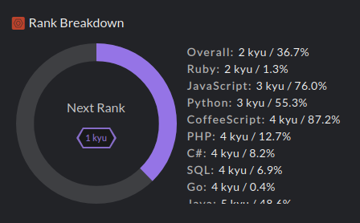
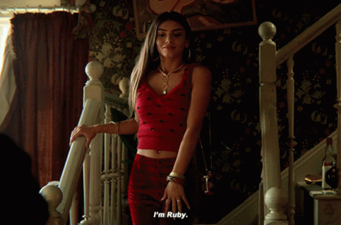
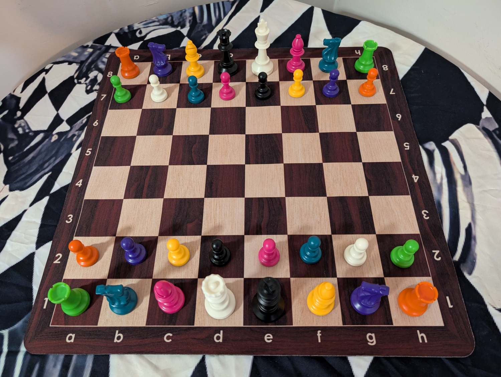

<!-- start-data -->

<h1>✨ How's tricks? 👋</h1>

  <table>
    <tr>
      <td align="center">
        
      </td>
      <td align="center">
        
      </td>
      <td align="center">
        
      </td>
    </tr>
  </table>

  <h2>👨‍🔬 🏩 💾 🇦🇺</h2>
  <h2><a href="https://github.com/john-bampton">John Bampton</a> is a dedicated, skilled, and community-oriented individual within the technology and local Brisbane communities</h2>

  <h2>🏎️ The Autobots will invite you on "Star" 🌠</h2>
  <h3>Add a "⭐" to this <a href="https://github.com/john-bampton/.github">repository</a> and you will be auto invited to join the <a href="https://github.com/john-bampton">John Bampton</a> GitHub Organization ⏩ 🏦</h3>

  

  <h2>Career Achievements ✅</h2>
  
  
  
  
  

  <h2><a href="https://en.wikipedia.org/wiki/Ky%C5%AB">🥋 Ruby Warrior</a></h2>
  

    
     
    <a href="#codewars-beast">Jun'ikkyū 準一級</a>
     
    <a href="https://www.codewars.com/users/Beast">Nikyū 二級</a>
     
    <a href="https://github.com/mruby/mruby/graphs/contributors">Sankyū 三級</a>
     
    <a href="https://github.com/mruby/mgem-list/graphs/contributors">Yonkyū 四級</a>
     
    <a href="https://contributors.rubyonrails.org/">Gokyū 五級</a>
      
    <a href="https://github.com/mruby/mruby.github.io/graphs/contributors">Rokkyū 六級</a>
     
    <a href="https://github.com/whitesmith/rubycritic/graphs/contributors">Nanakyū 七級</a>
      
    <a href="https://github.com/natalie-lang/natalie/graphs/contributors">Hachikyu 八級</a>
      
    <a href="https://github.com/sponsors/hsbt#sponsors">Kyūkyū 九級</a>
     
    <a href="https://github.com/ruby/ruby/commit/97a114de44c71c688e8ba928da41bc396153ef5d">Jukkyū 十級</a>
         
    <a href="https://github.com/robygems">Mukyū 無級</a>
     
  

  

    
  

  <h2>🎨 Chess is Art ♟️</h2>

## Open Your Mind

- Fuel exploded in tube. (4). Flue
- Loves cracking answer. (5). Solve

### Level Up

- Opening book beside Central Park tavern. (3). Bar
- Leaves note with answer. (3). Tea
- Vegetable found in vehicle along with rubbish. (6). Carrot
- PC's speed makes music session a failure. (8). Gigaflop

### Mind Blown

- Sound asleep but not in when Dracula arrives? (3,3,3,5). Out for the count
