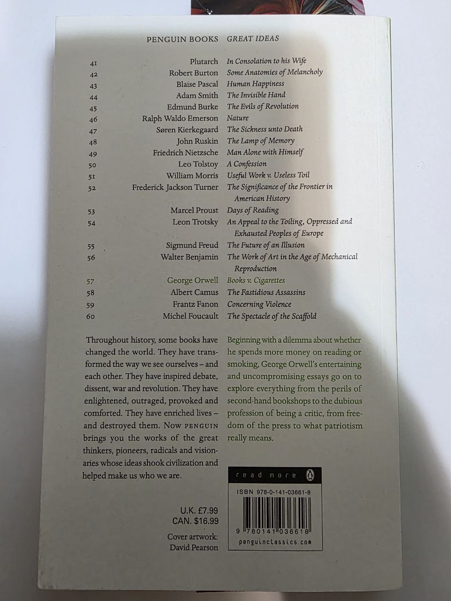
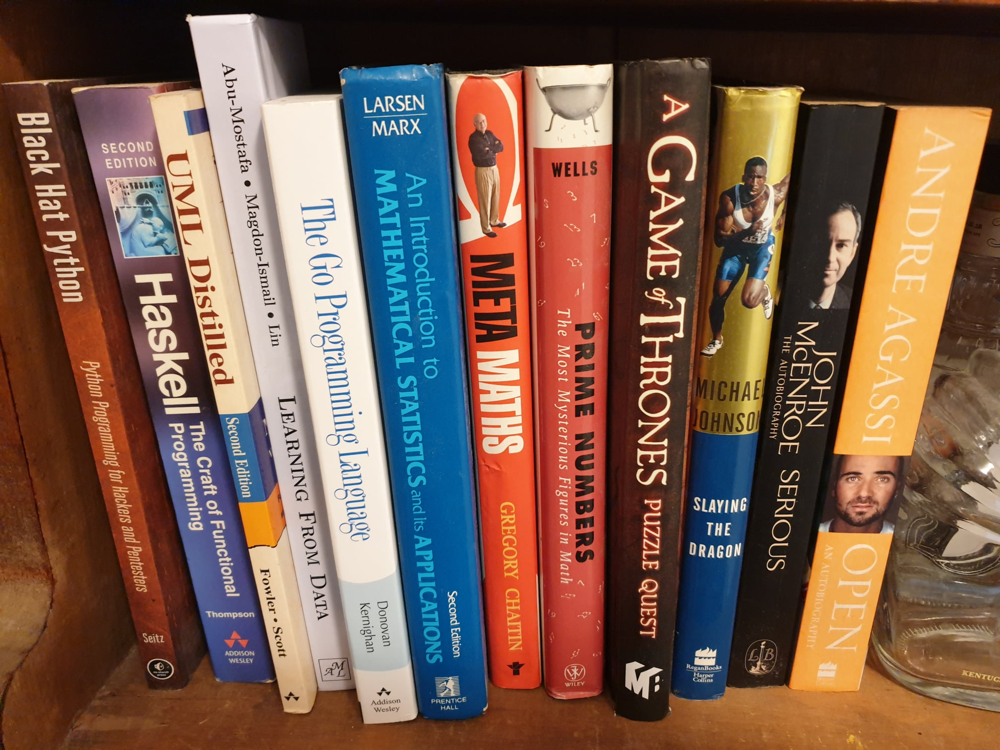
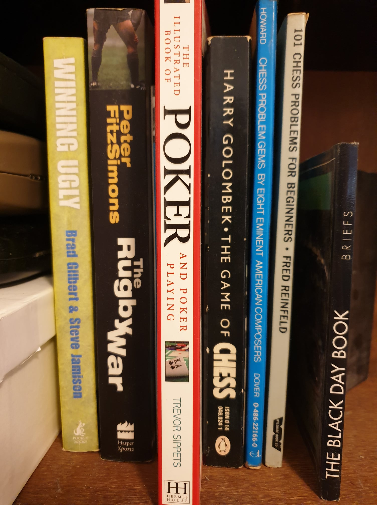
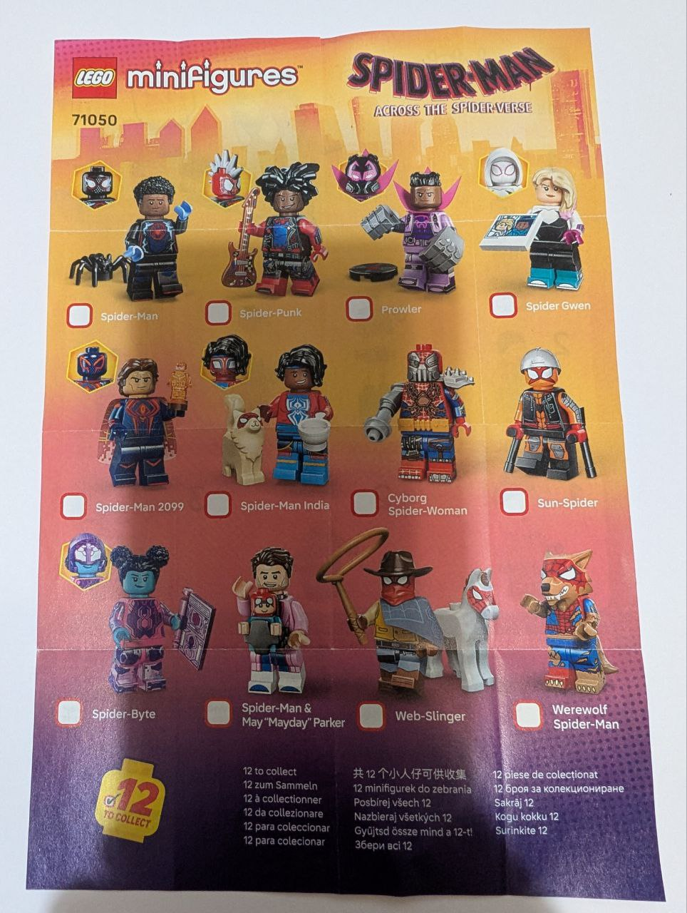
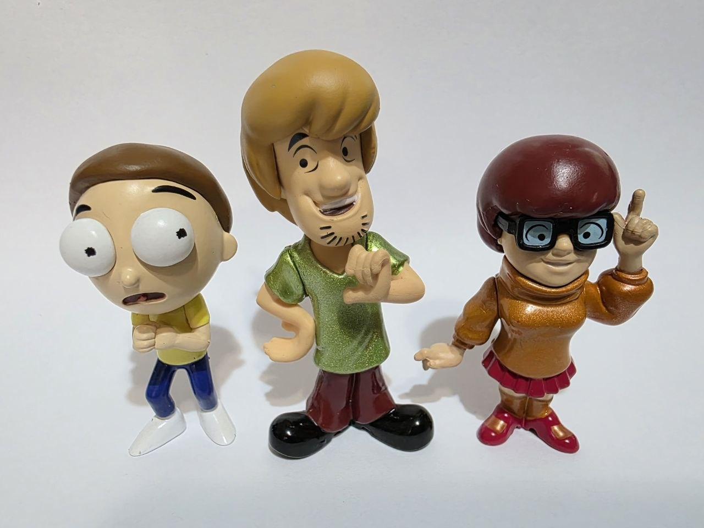
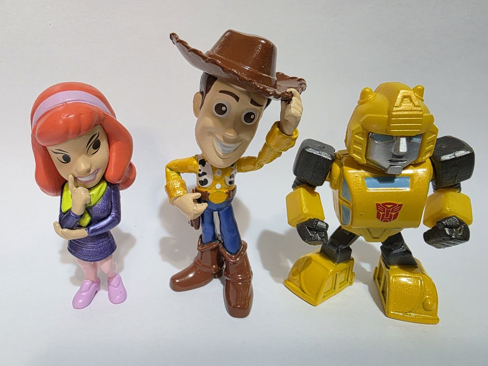
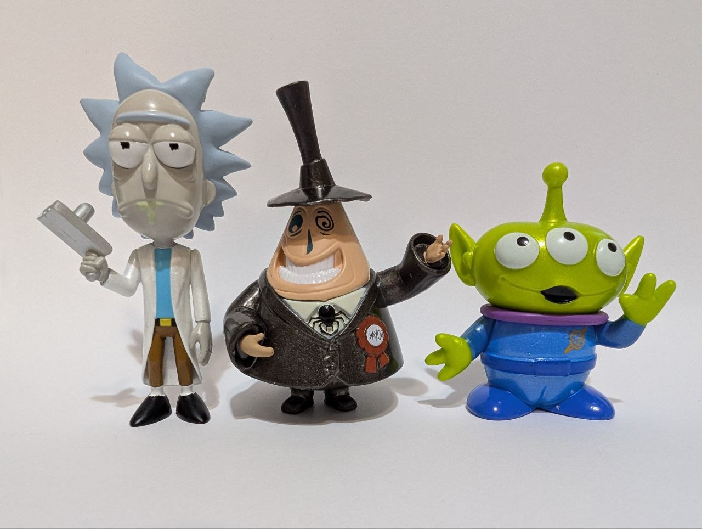
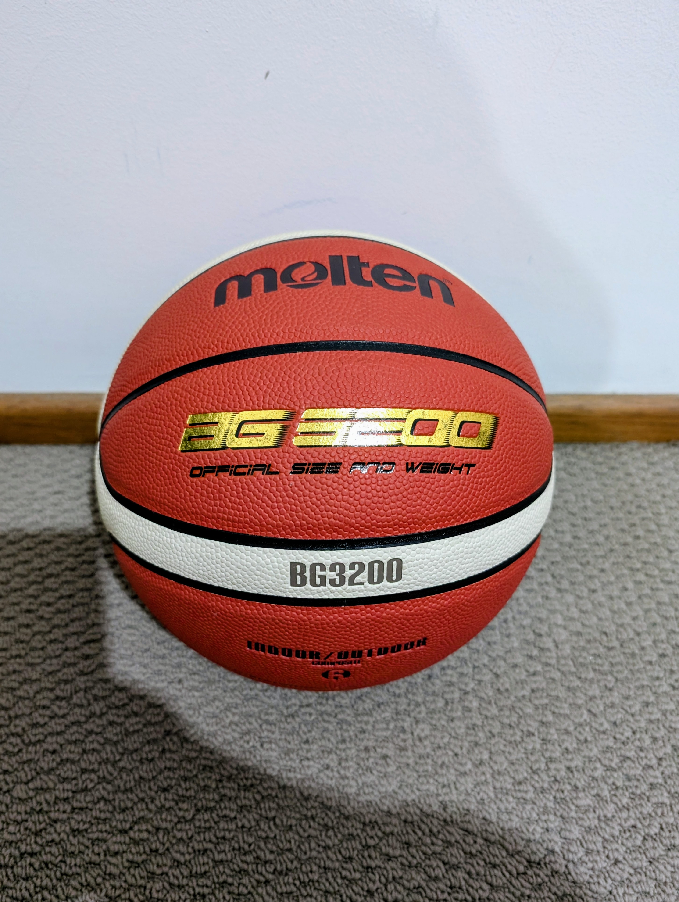

<!-- start-data -->

  <h1>✨ How's tricks? 🪄 🔮 🧝‍♂️ </h1>

  <h2>Career Achievements ✅</h2>
  <h3>👨‍🔬 🏩 💾 🇦🇺</h2>

---

# Special Thank You

Thanks to all the authors and publishers of the great books listed in this readme. I have been collecting books for over 40 years and I recommend that you should buy some of the books listed here. Promoting the books and authors using mostly Amazon and Wikipedia links for consistentency but usually I buy the books either locally at [Dymocks](https://www.dymocks.com.au), [QBD](https://www.qbd.com.au), The [Cystic Fibrosis Bookshop](https://www.cfqld.org.au/cystic-fibrosis-queensland-bookshop/) or at other online stores. 

---

# Some things about me

## May 6th, 2026

- Tonight I am unboxing and the first new item I have opened is a pink [Faber-Castell](https://en.wikipedia.org/wiki/Faber-Castell) "Sleeve Doppelspitzer". The Faber-Castell Sleeve Doppelspitzer is an ergonomic, award-winning (ISPA Award 2007) double pencil sharpener with an integrated waste container, designed to sharpen both standard and jumbo graphite or colored pencils (up to 11mm diameter). [Faber-Castell](https://www.faber-castell.com) AG is a German privately held multinational manufacturer of pens, pencils, other office supplies (e.g., staplers, slide rules, erasers, rulers) and art supplies, as well as high-end writing instruments and luxury leather goods. Founded in 1761 Faber-Castell produces quality products.
- [The Times Quick Cryptic Crossword Book 1](https://www.amazon.com.au/Times-Quick-Cryptic-Crossword-book/dp/0008139814/) features 80 world-famous crossword puzzles that were originally published in 2014 the year the series first started. From this books one page introduction by [Richard Rogan](https://timesforthetimes.co.uk/richard-rogan-rip) I originally learned about the "NINA" or hidden theme that a puzzle setter will sometimes include. An example puzzle with a quick five page guide on how to solve it follows the introduction. A small book with just 192 pages good to carry around in my bag. [The Times](https://en.wikipedia.org/wiki/The_Times) is a newspaper that started in 1785, a quality publication and I also like their chess books.
- I'm a fan of Jeffrey Archers books and recently I read [Twelve Red Herrings](https://en.wikipedia.org/wiki/Twelve_Red_Herrings) for the second time after about 20 years. Twelve Red Herrings is a 1994 collection of twelve suspenseful short stories. The book is famous for its twist endings, where Archer challenges readers to identify a "red herring"—a misleading clue or diversion—hidden within each narrative. [Jeffrey Howard Archer](https://en.wikipedia.org/wiki/Jeffrey_Archer), Baron Archer of Weston-super-Mare (born 15 April 1940) is an English novelist and former politician. He was the Member of Parliament (MP) for Louth (Lincolnshire) from 1969 to 1974, but did not seek re-election after almost going bankrupt. Archer revived his fortunes as a novelist. His novel Kane and Abel (1979) remains one of the best-selling books in the world, with an estimated 34 million copies sold worldwide. Overall his books have sold more than 320 million copies worldwide.

## Mar 22nd, 2026

- Recently bought two new books: [The Sun Two-Speed Crossword Collection #12](https://www.amazon.com.au/Two-Speed-Crossword-Collection-two-one/dp/0008673195) and [Daily Mail The Big Book of Cryptic Crosswords Volume 8](https://www.amazon.com.au/Daily-Mail-Book-Cryptic-Crosswords/dp/0600635678). Both crossword books are fantastic and I really like the Two-Speed style with both cryptic and quick clues for each puzzle. [The Sun](https://en.wikipedia.org/wiki/The_Sun_(United_Kingdom)) is a British tabloid newspaper, published by the News Group Newspapers division of News UK, itself a wholly owned subsidiary of Lachlan Murdoch's [News Corp](https://en.wikipedia.org/wiki/News_Corp). The [Daily Mail](https://en.wikipedia.org/wiki/Daily_Mail), often known simply as the Mail, is a British daily middle-market tabloid conservative newspaper founded in 1896 and published in London.

## Feb 20th, 2026

- Just enjoyed reading the section on chess from [Around the World in 80 Games: A mathematician unlocks the secrets of the greatest games](https://www.amazon.com.au/Around-World-80-Games-mathematician-ebook/dp/B0BY85GH3Z).
Author and mathematican [Marcus du Sautoy](https://en.wikipedia.org/wiki/Marcus_du_Sautoy) gave an interesting account of the history of chess and its origins over 8.5 pages with a mathematical perspective. 
- Recommenced working on [Mindful Mixed Puzzles: Over 600 puzzles](https://lakepress.com.au/products/mindful-600-puzzles-mixed-puzzles-pastel-green). This fantastic ring bound book has 8 types of puzzles and so
far I have only worked on two types of puzzles: the Word Square and the Word Chain.
- Found a small `Simply Word Fill-Ins` [Puzzler](https://www.puzzler.com.au/magazines/) brand magazine issue number 87 with 100 puzzles from 2024 which cost $6.95 AUD. Whilst I did enjoy completing two fill-ins,
  I found it was really easy to complete them since the answers were given and you just had to fill-in the grid. I definitely prefer a much harder challenge.
- Opened a [Spider-Man brand LEGO minifigure](https://www.lego.com/en-au/product/spider-man-across-the-spider-verse-71050) which cost $5 AUD from [Coles Supermarket](https://en.wikipedia.org/wiki/Coles_Supermarkets). There are 12 to collect and each minifigure comes in a blind pick small cardboard box. This one was the `Spider-Byte` minifigure the last packet on the shelf.

## 2026

- Currently working on some of the puzzles from the magazine "Christine's Big Crossword" Issue 392.
  This magazine has 28+ giant puzzles and cost $9.50 AUD.
  `Lovatts Crosswords and Puzzles` is a family run business that sells a number of different
  [puzzle magazines](https://lovattspuzzles.com/lovatts-crossword-puzzle-magazines/)
- I am up to puzzle 16 from [The Times Chess Winning Moves: 540 Chess Puzzles from Tournament Play](https://www.amazon.co.uk/Times-Chess-Winning-Moves-Tournament/dp/0008748888).
  Really enjoyed the first 15 puzzles and the commentary from author Byron Jacobs.
  Published in 2025 most puzzles are from modern games with the first intro puzzle being a Magnus Carslen victory.
  [The Times](https://en.wikipedia.org/wiki/The_Times) is a British daily national newspaper based in London.
- I have read 50 pages of the famous book [Minute Cryptic](https://www.minutecryptic.com/) a bestseller that teaches you how to solve cryptic crossword clues.
  [Check out the Minute Cryptic YouTube Channel](https://www.youtube.com/@MinuteCryptic)
- Currently reading [Checkmate! The Wonderful World of Chess](https://www.amazon.com.au/Checkmate-Wonderful-World-John-Foley/dp/1839352485) by author John Foley up to page 42.
  A glossy colorful and easy to read 112 page book aimed at beginners and children full of illustrations.
- I'm happy with the QX Chess small magnetic foldable chess board that I am now using on my work desk.
  [No. QX2677](https://www.mrtoys.com.au/games/board-games/chess-sets/magnetic-chess-47245.html) with black and white pieces and black and gray colored squares
  originally bought for $10 AUD

---

## [Cryptic Crosswords](https://en.wikipedia.org/wiki/Cryptic_crossword)

Some notable clues and answers from various publications

### Open Your Mind

- Fuel exploded in tube. (4). Flue
- Loves cracking answer. (5). Solve
- Pay no attention to damaged region. (6). Ignore

### Level One

- Opening book beside Central Park tavern. (3). Bar
- Leaves note with answer. (3). Tea
- European ruler beheaded mathematician. (5). Euler
- Vegetable found in vehicle along with rubbish. (6). Carrot
- Crazed parrot, one entering Gatwick? (7). Airport
- Nun with grin switched on. (7). Running
- PC's speed makes music session a failure. (8). Gigaflop

### Level Two

- Treat in barrel for redhead? (6,3). Ginger nut
- Everything's ready: eg lass mostly prepared. (3,7,2). All systems go
- Biblical location of endangered variety. (6,2,4). Garden of Eden
- Go wild - show off your locks. (3,4,4,4). Let your hair down
- Modern, before sixty seconds have passed. (2,2,3,6). Up to the minute

### Mind Blown

- Sound asleep but not in when Dracula arrives? (3,3,3,5). Out for the count

---

  <h1>Wow !! You just found John's growing Chess World ♟️ </h1>
  

## Quality Chess Books

The evolution of chess literature has shifted significantly toward user-friendly design, prioritizing visualization and scannability over the dense, notation-heavy layouts of the 20th century.

High-quality chess books use large, high-contrast diagrams with modern piece fonts that are much easier on the eyes than older, cramped layouts. They provide frequent illustrations so you can follow the action without needing to set up a physical board for every move. Better books also categorise puzzles by theme and include verbal explanations of the logic, rather than just listing long strings of confusing notation. Finally, reputable modern publishers use superior paper and ink, ensuring the "black and white" contrast is sharp and the pages don't bleed or fade.

All books in the list below are high quality publications and personally recommended. More books to be added soon.

| Title | Author | Publisher | Date | Type | # of Pages |
| ----- | ------ | --------- | ---- | ---- | ---------- |
| Chess Winning Moves: 540 Chess Puzzles from Tournament Play | Byron Jacobs | The Times | 2025 | Paperback | 240 |
| Learn Chess From The Greats | Peter J. Tamburro, Jr. | Dover Publications | Published in 2000 this edition printed in 2022 | Paperback | 156+ |
| The Chess Player's Bible: Illustrated Strategies For Staying Ahead Of The Game; Second Edition | Eade & Lawrence | Apple Press; A QUARTO BOOK | 2014 | Ring bound hardcover | 288 |

## Chess References in Dictionaries

A lot of the dictionaries below use different notation to markup words and phrases. More work to be done on markup soon.

- [The Bantam Crossword Dictionary](https://www.amazon.com.au/Bantam-Crossword-Dictionary-Walter-Glanze/dp/0553263757): The Easy-to-Use, Easy-to-Read Classic Handbook for Today's Puzzle Solvers. Featuring 40 Special Tables, Plus an Exclusive Long-Word Finder. Reissue Edition November 2007. This dictionary is a widely used reference handbook for crossword enthusiasts, notably featuring over 50,000 clues and 160,000 solutions. Edited by Walter D. Glanze and Jerome Fried, it is designed for both home and travel use, organized alphabetically for quick reference.
  - **chess defeat** / MATE; CHECKMATE
  - **chess move** / FORK; CASTLE; FIANCHETTO
  - **chess opening** / PIRC; DEBUT; GAMBIT; RUYLOPEZ
  - **chess piece** / MAN; KING; PAWN; ROOK; QUEEN; BISHOP; CASTLE; KNIGHT
  - **chess pieces** / MEN
  - **chess term** / MATE; ISOLANI; EXCHANGE; ENPASSANT; OPPOSITION

  In [Aron Nimzowitsch](https://en.wikipedia.org/wiki/Aron_Nimzowitsch)'s very famous book [My System](https://en.wikipedia.org/wiki/My_System) he describes an isolated pawn on the d-file as an isolated queen pawn or simply an `isolani`.

- [Collins French Dictionary: Pocket Edition](https://www.amazon.com.au/Collins-French-Dictionary-Pocket-Portable/dp/0008183627): Packed with words for when you are on the move. Eighth Edition published in 2017. This dictionary is a portable bilingual dictionary published by HarperCollins. It is designed for learners, travelers, and business professionals, offering modern coverage of French and English.
  - **èchec** nm failure; (Èchecs): **\~ et mat/au roi** checkmate/check;
  - **èchecs** nmpl (jeu) chess sg; **tenir en \~** to hold in check

- [Macquarie Budget Dictionary: Australia's National Dictionary](https://www.amazon.com.au/Macquarie-Budget-Dictionary/dp/1761562754/). This edition published in 2004. This dictionary is a recognized, compact, and affordable reference for Australian English, often referred to as Australia's national dictionary. It is designed for daily use at home, school, or the office.
  - **chess** n. a game played by two persons, each with sixteen pieces, on a chequered board. 

- [The New Comprehensive A-Z Crossword Dictionary: Compiled by Edy Garcia Schaffer](https://www.ebay.com.au/p/95793516) is a widely recognized, top-selling reference for crossword enthusiasts, often cited as containing over 225,000 entries and 50,000 new words in its revised editions. The 1996 printing is a popular paperback edition, frequently listed as a comprehensive guide spanning over 1,300 pages.
  ...

---

# The Back Covers of Famous Books

# 40+ Years Of Collecting Books

---

---

  
<a href="https://www.jadatoys.com">Jada Toys</a>, Inc. is an American manufacturer of collectible scale model cars, action figures, radio controlled model vehicles, and dolls. It was founded in 1999 by Jack and May Li. <a href="https://en.wikipedia.org/wiki/Jada_Toys">Jada's</a> products are predominantly aimed at the collectible market, and are available and popular at retail outlets worldwide.

  
Jada Toys Metalfigs are highly collectible, stylized figurines made from 100% die-cast metal. They feature a heavy, premium feel with high-quality metallic paint and authentic character details. These figures come in various sizes, ranging from the tiny 1.65-inch Nano Metalfigs to larger 6-inch display pieces. While most are static, non-articulated poses, they cover massive franchises like Marvel, DC, Disney, and Transformers. They are popular for both play and display due to their durability and the availability of themed diorama sets.

  

  
  

    <a href="https://en.wikipedia.org/wiki/Morty_Smith">Morty Smith</a>, <a href="https://en.wikipedia.org/wiki/Shaggy_Rogers">Norville "Shaggy" Rogers</a>, <a href="https://en.wikipedia.org/wiki/Velma_Dinkley">Velma Dinkley</a>
  

---

---

# BasketBall

Really enjoy taking my Molten Ball out for a trip around the town. A smaller six 6 ball with a great bounce really prefer this over my size 7 balls. If you know about basketballs you will know about the different balls some with the "dead" bounce. Several specialized basketballs are designed to feel "dead" (less bouncy) or feature thicker, heavier construction to improve handling and strength. These are often used for training, such as weighted or heavy trainer basketballs.

