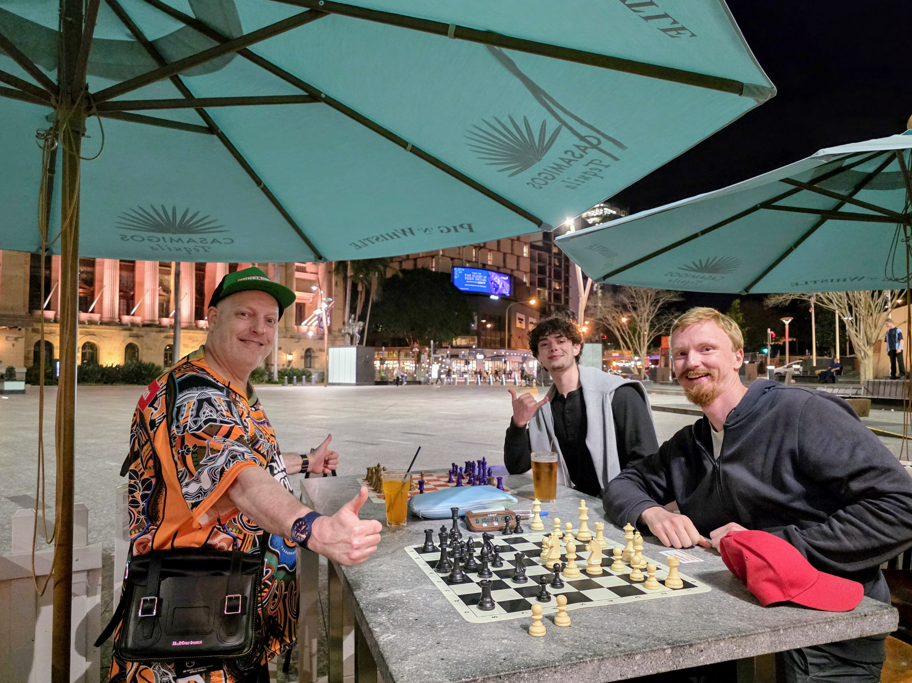

<!-- start-data -->

  <h1>✨ How's tricks? 🪄 🔮 🧝‍♂️ </h1>

  <h2>Career Achievements ✅</h2>
  <h3>👨‍🔬 🏩 💾 🇦🇺</h2>

---

  <h2>🥤✨ Check out "The Tasty Beverage" the new home for all my content</h2>

---

## Join us at [The Apache Software Foundation](https://apache.org/) and work on global projects

### Our Philosophy is `Community Over Code` and your ideas are welcome

### My ASF Projects listing some large global organizations and users 

[Apache CloudStack](https://cloudstack.apache.org/) - See the [Apache CloudStack Users](https://cloudstack.apache.org/users)

[Apache OpenOffice](https://www.openoffice.org/) - Over 390 million downloads

[Apache Sedona](https://sedona.apache.org/latest/) - AT&T, BMW, Boeing, JPMorganChase, Shell, SpaceX, Uber and more

## Join The ASF Discord Communities!

---

## Meet John ♟️ 😎

### Playing two men at once in King George Square at the [Pig N Whistle](https://pignwhistle.com.au/king-george-square). Final Score: John 1.5 : Two Men 0.5. The dark haired office worker resigned after getting his Queen trapped and the blonde Swedish man who was a tourist scored a draw by mutual agreement.  

---

# Modified Metcalfe's Law in Open Learning

The "modified Metcalfe's Law" of open learning states that an educational network's value scales exponentially (closer to $V \propto n^3$ than standard $V \propto n^2$) with each active contributor. This drastically outpaces traditional, isolated university models by leveraging rapid, global, and highly scalable peer-to-peer knowledge exchange.

### The Mechanics of Open Learning
*   **Hyper-Exponential Growth:** While Metcalfe's original law modeled a network's value as proportional to the square of its users ($V \propto n^2$), recent scaling studies on massive collaborative platforms suggest that modern interaction limits and repository mirroring follow a cube law ($V \propto n^3$). Each new learner doesn't just add one connection; they exponentially increase the nodes for peer-based help, issue tracking, and collaborative iteration.
*   **The Power of Forks and PRs:** Platforms like GitHub scale through continuous integration and version control. When a student fork or pull request corrects or enhances a public curriculum, that learning compounds for the entire network simultaneously.
*   **Public Network Value:** In open learning, the educational repository itself becomes a living, crowd-sourced asset. Unlike closed-loop university systems where knowledge is siloed within individual classrooms, GitHub-style learning grows by absorbing the collective intelligence of public contributors.

### Traditional University vs. Open Network Learning

| Feature | Traditional Self-Learning (Unis) | Open Learning (GitHub) |
| :--- | :--- | :--- |
| **Growth Potential** | Linear and restricted by cohort sizes and instructor bandwidth. | Exponential. Network value and knowledge scale by the cube of active users. |
| **Value Driver** | Monolithic, top-down curriculum delivery. | Collective intelligence. Knowledge is crowdsourced, peer-reviewed, and improved iteratively. |
| **Feedback Loop** | Delayed; typically limited to an instructor's grading schedule. | Instantaneous; global contributors can immediately spot bugs, issue pull requests, or clarify concepts. |
| **Asset Lifespan** | Private. Course materials belong to the university and expire/update on a closed schedule. | Public and permanent. Open Educational Resources (OER) remain accessible and mutable globally. |

### Why Open Source Scaling Wins
In private self-learning or traditional higher education, utility is capped by the number of students enrolled and their individual cognitive capacity. By contrast, the Open Source Initiative model shifts education into a social ecosystem. The marginal cost of distributing an update approaches zero, while the marginal utility of having a global community debug, update, and improve the learning material drives explosive, compounding growth in value.

